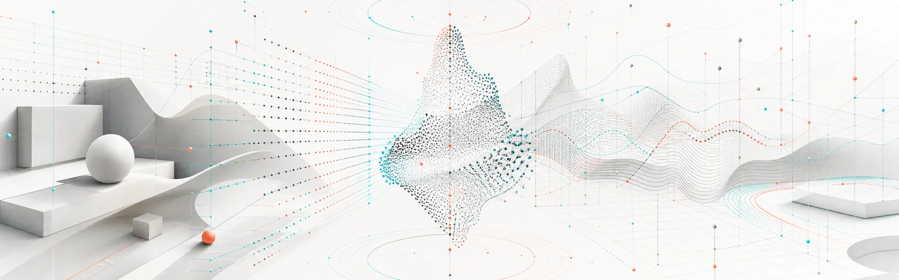

# Maxinsights

We are building the data foundation for Physical AI. Our mission is to deliver high-quality data at global scale through our global capture network.

## Our team

Our team brings experience from Bosch, Google, Meta, X's Moonshot Factory, DeepMap, Momenta, NIO, QCraft, TuSimple, and Waymo.

## Research partners

We work with research partners at:

- Stanford University
- University of California, Los Angeles
- University of Southern California
- University of California, Berkeley
- The University of Texas at Austin

## Repository status

This is an early public repository. It currently contains a small set of visual assets. We will add project material and documentation over time.

## Learn more

- Visit [maxinsights.ai](https://www.maxinsights.ai/) for company information.
- Use the early-access form on the website to contact us about access.

## Licensing

See [LICENSE](./LICENSE) for usage terms and third-party notices.
