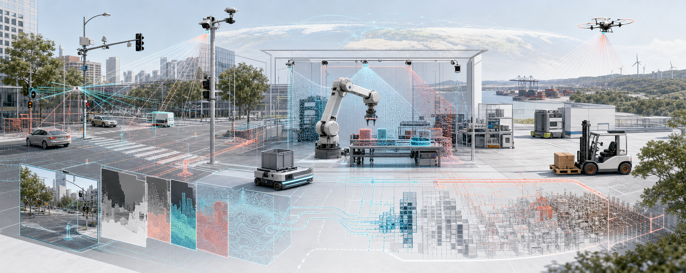

# Max Insights

[Max Insights](https://www.maxinsights.ai/) is building the data foundation for Physical AI. The company focuses on collecting and delivering high-quality data through a global capture network.

## Mission

Max Insights aims to make high-quality Physical AI data available at global scale. Its approach centers on three priorities:

- **Global capture:** A worldwide network for collecting data across locations.
- **Scalable delivery:** An approach designed to deliver data at global scale.
- **Data quality:** A focus on high-quality data while reducing manual work.

Our team brings experience from Bosch, Google, Meta, X's Moonshot Factory, DeepMap, Momenta, NIO, QCraft, TuSimple, and Waymo.

## Research partners

Max Insights works with research partners at:

- Stanford University
- University of California, Los Angeles
- University of Southern California
- University of California, Berkeley
- The University of Texas at Austin

## Repository contents

This repository currently contains a small collection of visual assets:

### Asset previews

<table>
  <tr>
    <td align="center" width="50%"></td>
    <td align="center" width="50%"></td>
  </tr>
  <tr>
    <td align="center"><code>hdash.png</code></td>
    <td align="center"><code>hdash1.jpg</code></td>
  </tr>
  <tr>
    <td align="center"></td>
    <td align="center"></td>
  </tr>
  <tr>
    <td align="center"><code>hannotation.svg</code></td>
    <td align="center"><code>zdash.svg</code></td>
  </tr>
</table>

| File | Format | Description |
| --- | --- | --- |
| `hannotation.svg` | SVG | Hand annotation icon |
| `hdash.png` | PNG | HDash dashboard graphic at 1024 x 1024 |
| `hdash1.jpg` | JPEG | HDash dashboard graphic at 832 x 680 |
| `max-insights-header.png` | PNG | Physical AI data capture banner at 1983 x 793 |
| `zdash.svg` | SVG | Orange ZDash mark |

## Project status

This is an early public repository. More project material and documentation will be added here over time.

## Learn more

- Visit [maxinsights.ai](https://www.maxinsights.ai/) for company information.
- Use the early-access form on the website to contact Max Insights about access.
